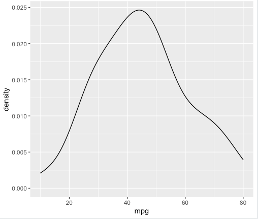
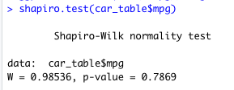
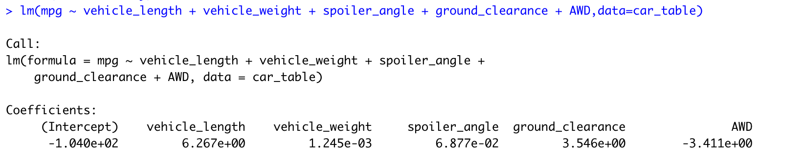
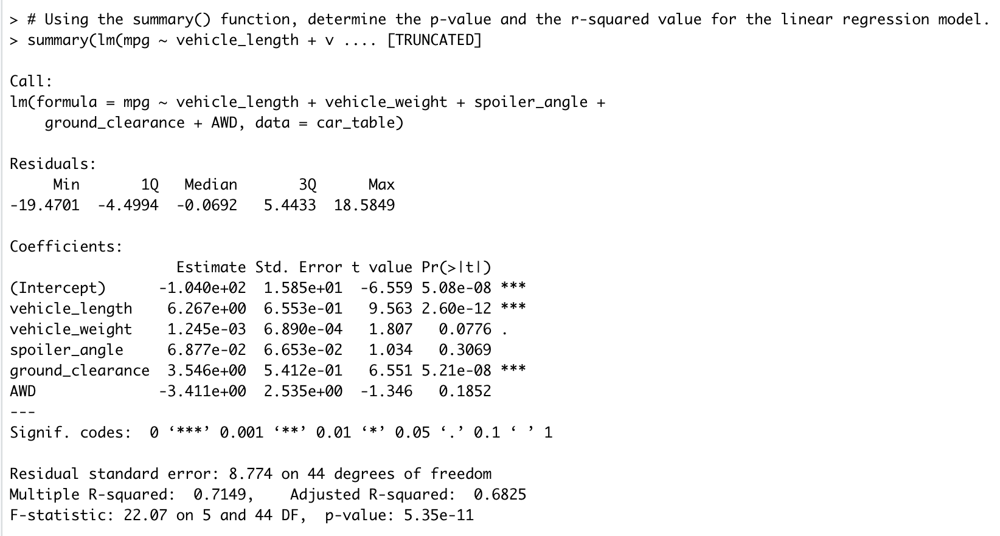
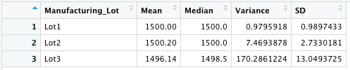
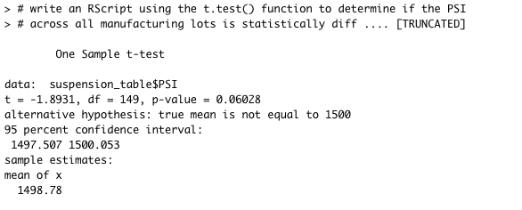
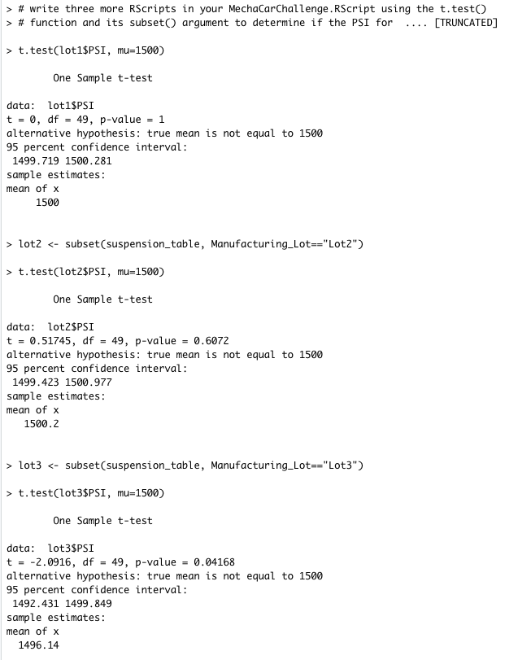

# MechaCar_Statistical_Analysis

## Overview

AutosRUs’ newest prototype, the MechaCar, is suffering from production troubles that are blocking the manufacturing team’s progress. This analysis is a review of the production data for insights that may help the manufacturing team.

In this analysis, I will do the following:

- Perform multiple linear regression analysis to identify which variables in the dataset predict the mpg of MechaCar prototypes
- Collect summary statistics on the pounds per square inch (PSI) of the suspension coils from the manufacturing lots
- Run t-tests to determine if the manufacturing lots are statistically different from the mean population
- Design a statistical study to compare vehicle performance of the MechaCar vehicles against vehicles from other manufacturers. For each statistical analysis, you’ll write a summary interpretation of the findings.

## Linear Regression to Predict MPG

The dataset contains mpg test results for 50 prototype MechaCars. The MechaCar prototypes were produced using multiple design specifications to identify ideal vehicle performance. Multiple metrics, such as vehicle length, vehicle weight, spoiler angle, drivetrain, and ground clearance, were collected for each vehicle. This section describes the design of a linear model that predicts the mpg of MechaCar prototypes using several variables from the dataset. 

To start, let's test the distribution of mpg in the dataset using ggplot2. 

The following image shows the distribution plot for mpg of our sample dataset.

We can see from the plot that the distribution approximates a normal distribution and an be used for further analysis.

Next, we want to confirm that the data in our sample dataset came from a normally distributed dataset. I use the Shapiro-Wilk test to perform this test as shown in the following diagram.

Since the p-value is greater than 0.05, we consider the data to be normally distributed.

The following image shows the input for running the linear regression model and the output.

The following image shows the input for running the summary function and the output.

From the output of the linear regression and the summary function we can draw the following conclusion:
- The vehicle length and vehicle ground clearance have p-values that indicate a significant impact on miles per gallon on the MechaCar prototype.
- The vehicle weight, spoiler angle, and All Wheel Drive (AWD) have p-Values that indicate a random amount of variance with the dataset.
- The slope of the linear model is not considered to be zero.  Why or why not?
- This linear model has an r-squared value of 0.7149, which means that approximately 71% of all mpg predictions will be determined by this model. Relatively speaking, his multiple regression model does predict mpg of MechaCar prototypes effectively.

## Summary Statistics on Suspension Coils

write a short summary using screenshots from your total_summary and lot_summary dataframes, and address the following question:

The design specifications for the MechaCar suspension coils dictate that the variance of the suspension coils must not exceed 100 pounds per square inch. Does the current manufacturing data meet this design specification for all manufacturing lots in total and each lot individually? Why or why not?

The variance of the suspension coils does not exceed the limit of 100 pounds per square inch for all lots combined.  However, analyzing the data for each individual lot shows that the variance is exceeded at Lot3 which has a variance of 170.

## T-Tests on Suspension Coils

In this section, I provide the analysis fo the t-test results and I include screenshots of the t-test to support my summary.

The following image shows the result of the t-test for all lots combined.

Assuming our significance level was the common 0.05 percent, our p-value for all lots combined is above our significance level. Therefore, we do not have sufficient evidence to reject the null hypothesis.

The following image shows the result of the t-test for each individual lot.

For Lot1 and Lot2, assuming our significance level was the common 0.05 percent, our p-value for these lots individually are above our significance level. Therefore, we do not have sufficient evidence to reject the null hypothesis.

For Lot3, assuming our significance level was the common 0.05 percent, our p-value for Lot3 individually is below our significance level. Therefore, there is sufficient statistical evidence to reject the null hypothesis.

The conclusion of this analysis is that Lot3 does have quality issues and performance is below Lot1 and Lot2.

## Study Design: MechaCar vs Competition

In this section, I write a short description of a statistical study that can quantify how the MechaCar performs against the competition. 

In today's competitive car market, consumers are looking at the Total Cost of Ownership when making a car purchase decision. Total cost of ownership, or TCO, is the purchase price of an asset plus its costs of operation, according to Investopedia. It's a more holistic way of looking at what a product actually costs you. When you're choosing among things you might buy — such as a vehicle — you look not just at the price (the short-term cost) but also the cost to operate it (the long-term cost). In the final analysis, the asset with lower total cost of ownership is the better value.  

The following variables impact the Total cost of ownership (TCO - Dependent Variable) of a vehicle and MechaCar needs to collect this information to run the statistical test for its cars and for the competitors cars for the last 5 years:
- Total Cash Price (Independent Variable)
- Depreciation (Independent Variable)
- Insurance (Independent Variable)
- Financing (Independent Variable)
- Taxes & Fees (Independent Variable)
- Fuel (Independent Variable)
- Maintenance (Independent Variable)
- Repairs (Independent Variable)
- Federal Tax Credits (Independent Variable)

Given this background information, I will set up the following null hypothesis or alternative hypothesis:

**Null Hypothesis (H0)**: MechaCar's Total Cost of ownership is comparable to similar vehicles from it's competitors

**Alternative Hypothesis (Ha)**: MechaCar's Total Cost of ownership is NOT comparable to similar vehicles from it's competitors

I will use **multiple linear regression**  to test the hypothesis.  This test will be used to determine the factors/independent variables that have the highest correlation/predictability with the Total Cost of ownership (dependent variable).

I will set the **significance level** to the normal value of 0.05.

